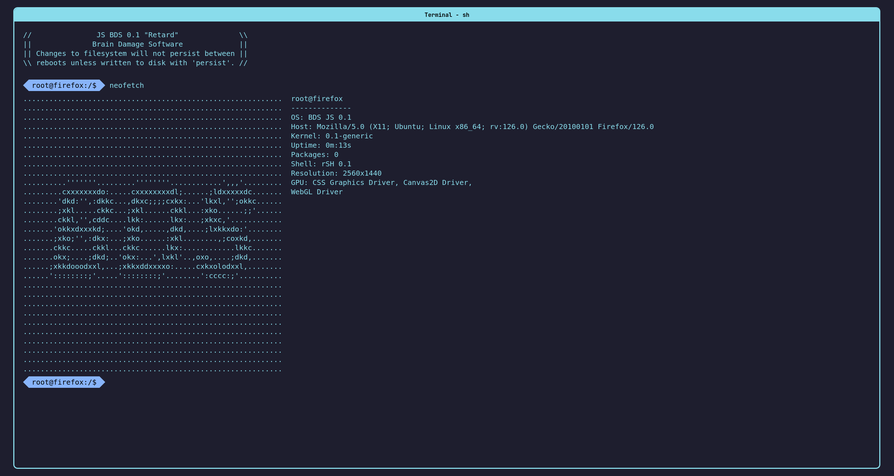

# BDS JS
Brain Damage Software - A "Unix-like" "OS" for the web browser, written in JavaScript.

It does not have init yet, only 1 process at a time, sorry. Anyone up to write systemd.js?  
[Read the developer documentation](./scripting.md)
[Try the live demo](https://pzpl.ovh/bdsjs)